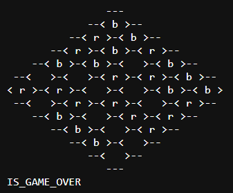

# Hex Game Analysis

## Description
Hex Game Analysis is a tool for analyzing and validating the classic game of Hex. The game is played on hexagonal board, with two players (red and blue) taking turns to place their respective pieces. The objective is to connect two opposite sides of the board with an unbroken chain of pieces of the player's color. The red player always starts first.

## Features
- **Board Size Detection**: Determines the size of the board from the input.
- **Pawn Count**: Counts the number of red and blue pawns on the board.
- **Board Validity Check**: Ensures the board has a valid setup, meaning the number of red pawns is either equal to or one more than the number of blue pawns.
- **Game Over Detection**: Checks if either player has won the game by connecting their respective sides.
- **Board Possibility Check**: Determines if the current board state is possible, meaning it is valid and no player has missed a win in a previous turn.
- **Diagonal Matrix Representation**: Converts the board to a diagonal matrix representation for easier pathfinding and validation.

## Rules
1. The game is played by two players (red and blue).
2. The red player starts first.
3. Players take turns placing a pawn of their color on any unoccupied cell.
4. The goal is to connect two opposite sides of the board with an unbroken chain of their pawns.

## Input Format
- A sequence of test cases, each beginning with the board representation followed by a series of queries.
- The board size can vary from 1 to 11. Red pawns are marked with 'r' and blue pawns with 'b'.
- Queries can be of the following types:
  - `BOARD_SIZE`: Returns the size of the board.
  - `PAWNS_NUMBER`: Returns the total number of pawns on the board.
  - `IS_BOARD_CORRECT`: Checks if the board setup is valid.
  - `IS_GAME_OVER`: Checks if the game is over and which player, if any, has won.
  - `IS_BOARD_POSSIBLE`: Checks if the current board state is possible without missing a previous win.

### Example Input

    

## Functions
- **`main()`**: The entry point of the program. Handles reading the input, processing each query, and outputting results.
- **`getBoardSize(const vector<string>& boardHex)`**: Returns the size of the board.
- **`countTotalPawns(const vector<string>& boardHex)`**: Counts the total number of pawns on the board.
- **`validateBoardSetup(const vector<string>& boardHex)`**: Validates if the board setup is correct.
- **`isGameOver(vector<vector<char>>& boarddiagonal)`**: Checks if the game is over and which player has won.
- **`isBoardPossible(vector<vector<char>>& board)`**: Determines if the current board state is possible.
- **`convertToMatrix(const vector<string>& boardHex)`**: Converts the board representation to a matrix.
- **`convertToDiagonalMatrix(vector<string>& boardHex)`**: Converts the board to a diagonal matrix representation.

## Implementation Details
- The board is stored in a diagonal matrix representation to facilitate pathfinding and game status validation.
- Custom functions are used to handle various queries about the board state and game status.
- Depth-first search (DFS) is employed to determine if a player has connected their sides of the board.

